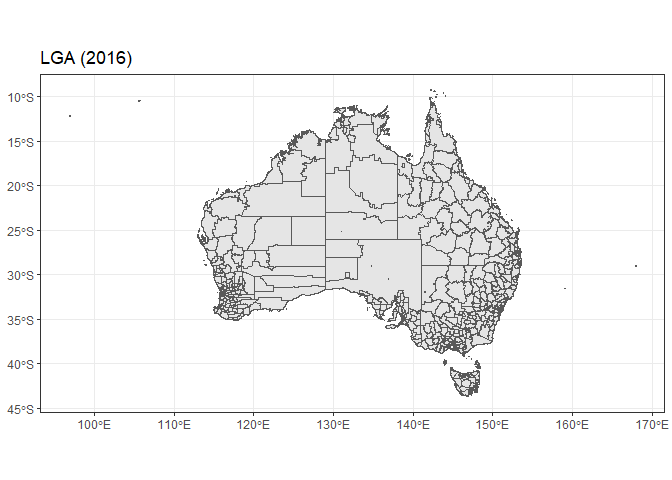

<!-- README.md is generated from README.Rmd. Please edit that file -->

# hpa.spatial <a href='https://healthpolicyanalysis.github.io/hpa.spatial/'></a>

<!-- badges: start -->

[](https://github.com/healthpolicyanalysis/hpa.spatial/actions/workflows/R-CMD-check.yaml)
<!-- badges: end -->

The goal of hpa.spatial is to make relevant shape files and data easily
available and include helpful functions for the analysis of spatial
data, focusing on the Australian (health) context.

## Notes on other packages

Most shape files are available within
[`{absmapsdata}`](https://github.com/wfmackey/absmapsdata) and can be
loaded using [`{strayr}`](https://github.com/runapp-aus/strayr).

The way that data are accessed with hpa.spatial both uses these packages
as well as replicating their approach to access data from
[`{hpa.spatial.data}`](https://github.com/healthpolicyanalysis/hpa.spatial.data).

## Installation

You can install the development version of hpa.spatial from
[GitHub](https://github.com/) with:

``` r
# install.packages("remotes")
remotes::install_github("healthpolicyanalysis/hpa.spatial")
```

``` r
library(hpa.spatial)
library(sf)
library(dplyr)
library(ggplot2)
```

## Getting shapefiles

`get_polygon()` is used to get shape files from the abs.

``` r
sa2_2016 <- get_polygon(area = "sa2", year = 2016)
head(sa2_2016)
#> Simple feature collection with 6 features and 14 fields
#> Geometry type: MULTIPOLYGON
#> Dimension:     XY
#> Bounding box:  xmin: 149.0781 ymin: -36.00922 xmax: 150.2157 ymax: -34.98032
#> Geodetic CRS:  WGS 84
#>   sa2_code_2016 sa2_5dig_2016                   sa2_name_2016 sa3_code_2016
#> 1     101021007         11007                       Braidwood         10102
#> 2     101021008         11008                         Karabar         10102
#> 3     101021009         11009                      Queanbeyan         10102
#> 4     101021010         11010               Queanbeyan - East         10102
#> 5     101021011         11011               Queanbeyan Region         10102
#> 6     101021012         11012 Queanbeyan West - Jerrabomberra         10102
#>   sa3_name_2016 sa4_code_2016  sa4_name_2016 gcc_code_2016 gcc_name_2016
#> 1    Queanbeyan           101 Capital Region         1RNSW   Rest of NSW
#> 2    Queanbeyan           101 Capital Region         1RNSW   Rest of NSW
#> 3    Queanbeyan           101 Capital Region         1RNSW   Rest of NSW
#> 4    Queanbeyan           101 Capital Region         1RNSW   Rest of NSW
#> 5    Queanbeyan           101 Capital Region         1RNSW   Rest of NSW
#> 6    Queanbeyan           101 Capital Region         1RNSW   Rest of NSW
#>   state_code_2016 state_name_2016 areasqkm_2016 cent_long  cent_lat
#> 1               1 New South Wales     3418.3525  149.7932 -35.45508
#> 2               1 New South Wales        6.9825  149.2328 -35.37590
#> 3               1 New South Wales        4.7634  149.2255 -35.35103
#> 4               1 New South Wales       13.0034  149.2524 -35.35520
#> 5               1 New South Wales     3054.4099  149.3911 -35.44408
#> 6               1 New South Wales       13.6789  149.2028 -35.37760
#>                         geometry
#> 1 MULTIPOLYGON (((149.7606 -3...
#> 2 MULTIPOLYGON (((149.2192 -3...
#> 3 MULTIPOLYGON (((149.2315 -3...
#> 4 MULTIPOLYGON (((149.2315 -3...
#> 5 MULTIPOLYGON (((149.2563 -3...
#> 6 MULTIPOLYGON (((149.2064 -3...

sa2_2016 |>
  ggplot() +
  geom_sf() +
  theme_bw() +
  ggtitle("SA2 (2016)")
```


``` r

lga_2016 <- get_polygon(area = "lga", year = 2016)
head(lga_2016)
#> Simple feature collection with 6 features and 7 fields
#> Geometry type: MULTIPOLYGON
#> Dimension:     XY
#> Bounding box:  xmin: 142.4523 ymin: -37.50503 xmax: 153.6076 ymax: -28.7043
#> Geodetic CRS:  WGS 84
#>   lga_code_2016         lga_name_2016 state_code_2016 state_name_2016
#> 1         10050            Albury (C)               1 New South Wales
#> 2         10130 Armidale Regional (A)               1 New South Wales
#> 3         10250           Ballina (A)               1 New South Wales
#> 4         10300         Balranald (A)               1 New South Wales
#> 5         10470 Bathurst Regional (A)               1 New South Wales
#> 6         10550       Bega Valley (A)               1 New South Wales
#>   areasqkm_2016 cent_long  cent_lat                       geometry
#> 1      305.9459  146.9704 -36.02660 MULTIPOLYGON (((147.0967 -3...
#> 2     8620.6990  151.8291 -30.33634 MULTIPOLYGON (((150.9923 -3...
#> 3      484.9389  153.4861 -28.85288 MULTIPOLYGON (((153.4496 -2...
#> 4    21690.6753  143.6116 -33.95034 MULTIPOLYGON (((143.5525 -3...
#> 5     3817.8646  149.5256 -33.43010 MULTIPOLYGON (((149.8696 -3...
#> 6     6278.8811  149.7176 -36.82594 MULTIPOLYGON (((149.9763 -3...

lga_2016 |>
  ggplot() +
  geom_sf() +
  theme_bw() +
  ggtitle("LGA (2016)")
```



This is used in the same way as `strayr::read_absmap()` except it also
includes a `simplify_keep` argument for simplifying the polygon.

``` r
sa2_2016_simple <- get_polygon(area = "sa2", year = 2016, simplify_keep = 0.1)

sa2_2016 |>
  filter(gcc_name_2016 == "Greater Brisbane") |>
  ggplot() +
  geom_sf() +
  scale_x_continuous(limits = c(152.9, 153.1)) +
  scale_y_continuous(limits = c(-27.4, -27.6)) +
  theme_bw()

sa2_2016_simple |>
  filter(gcc_name_2016 == "Greater Brisbane") |>
  ggplot() +
  geom_sf() +
  scale_x_continuous(limits = c(152.9, 153.1)) +
  scale_y_continuous(limits = c(-27.4, -27.6)) +
  theme_bw()
```


### Other shapefiles

Aside from the built in shapefiles that are hosted by `{absmapsdata}`,
`get_polygon()` can also access shapefiles for local hospital networks
(LHNs) and Primary Health Networks (PHNs).

For example, these can be accessed by the `"area"` or `"name"` arguments
as “LHN”.

``` r
qld_hhs <- get_polygon(area = "LHN") |> filter(state == "QLD")
#> The data for the Local Hospital Networks (LHN) are from here: <https://hub.arcgis.com/datasets/ACSQHC::local-hospital-networks/explore>
head(qld_hhs)
#> Simple feature collection with 6 features and 3 fields
#> Geometry type: MULTIPOLYGON
#> Dimension:     XY
#> Bounding box:  xmin: 137.9975 ymin: -29.1779 xmax: 153.5522 ymax: -15.90277
#> Geodetic CRS:  GDA2020
#> # A tibble: 6 × 4
#>   LHN_Name              state STATE_CODE                                geometry
#>   <chr>                 <fct> <chr>                           <MULTIPOLYGON [°]>
#> 1 Cairns and Hinterland QLD   3          (((146.1522 -17.99844, 146.1524 -17.99…
#> 2 Central Queensland    QLD   3          (((150.0524 -22.13545, 150.0573 -22.13…
#> 3 Central West (Qld)    QLD   3          (((143.2272 -21.31218, 143.2364 -21.31…
#> 4 Darling Downs         QLD   3          (((150.245 -25.4072, 150.2493 -25.4081…
#> 5 Gold Coast            QLD   3          (((153.4123 -27.9313, 153.4128 -27.931…
#> 6 Mackay                QLD   3          (((147.7665 -19.70548, 147.7666 -19.70…

qld_hhs |>
  ggplot() +
  geom_sf() +
  theme_bw()
```


## Mapping data between ASGS editions

`map_data_with_correspondence()` is used to map data across ASGS
editions.

When used with unit level data, it will randomly allocate the value to
the code of the updated edition based on the population-weighted
proportions (as probabilities) on the relevant correspondence table.

``` r
map_data_with_correspondence(
  codes = c(107011130, 107041149),
  values = c(10, 10),
  from_area = "sa2",
  from_year = 2011,
  to_area = "sa2",
  to_year = 2016,
  value_type = "units"
)
#> # A tibble: 2 × 2
#>   SA2_MAINCODE_2016 values
#>   <chr>              <dbl>
#> 1 107011547             10
#> 2 107041548             10
```

When used with aggregate data, it will split the value among the codes
of the updated edition based on the population-weighted proportions on
the relevant correspondence table.

``` r
map_data_with_correspondence(
  codes = c(107011130, 107041149),
  values = c(10, 10),
  from_area = "sa2",
  from_year = 2011,
  to_area = "sa2",
  to_year = 2016,
  value_type = "aggs"
)
#> # A tibble: 5 × 2
#>   SA2_MAINCODE_2016 values
#>   <chr>              <dbl>
#> 1 107011545           4.82
#> 2 107011546           3.62
#> 3 107011547           1.57
#> 4 107041548           4.49
#> 5 107041549           5.51
```

### Example

Suppose we have counts of patients within SA2s (2011) and we want to
aggregate these up into SA3s (2016 edition). Here is how we could do
this with `map_data_correspondence()` mapping up both to a higher level
of ASGS and to a more recent edition.

``` r
sa2_2011 <- get_polygon("sa22011")
sa2_2011$patient_counts <- rpois(n = nrow(sa2_2011), lambda = 30)

sa3_counts <- map_data_with_correspondence(
  codes = sa2_2011$sa2_code_2011,
  values = sa2_2011$patient_counts,
  from_area = "sa2",
  from_year = 2011,
  to_area = "sa3",
  to_year = 2016,
  value_type = "aggs"
) |>
  rename(patient_counts = values)
#> The following 18 codes were passed but are not valid (within the from geography) codes:
#> 197979799
#> 199999499
#> 297979799
#> 299999499
#> 397979799
#> 399999499
#> 497979799
#> 499999499
#> 597979799
#> 599999499
#> 697979799
#> 699999499
#> 797979799
#> 799999499
#> 897979799
#> 899999499
#> 997979799
#> 999999499
#> Error in get(filename) : object 'CG_SA2_2016_SA3_2016' not found
#> Failed to retrieve correspondence table through {strayr}, making correspondence table
#> Reading sa22016 file found in C:\Users\REX~1.PAR\AppData\Local\Temp\Rtmp2XHtTv
#> The following 18 codes were passed but are not valid (within the from geography) codes:
#> 197979799
#> 199999499
#> 297979799
#> 299999499
#> 397979799
#> 399999499
#> 497979799
#> 499999499
#> 597979799
#> 599999499
#> 697979799
#> 699999499
#> 797979799
#> 799999499
#> 897979799
#> 899999499
#> 997979799
#> 999999499

sa3_2016 <- get_polygon("sa32016") |>
  left_join(sa3_counts)
#> Reading sa32016 file found in C:\Users\REX~1.PAR\AppData\Local\Temp\Rtmp2XHtTv
#> Joining with `by = join_by(sa3_code_2016)`
```

``` r
sa2_2011 |>
  ggplot() +
  geom_sf(aes(fill = patient_counts)) +
  ggtitle("Patient counts by SA2 (2011)") +
  theme_bw()

sa3_2016 |>
  ggplot() +
  geom_sf(aes(fill = patient_counts)) +
  ggtitle("Patient counts by SA3 (2016)") +
  theme_bw()
```


