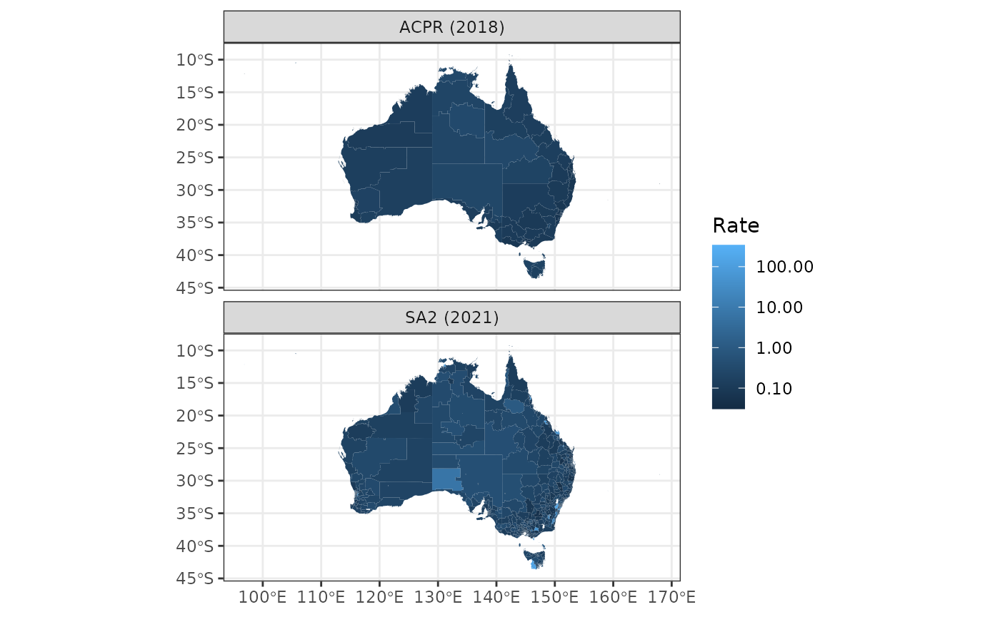

# Advanced mapping with correspondence example - ACPR

``` r

library(hpa.spatial)
library(sf)
library(dplyr)
library(ggplot2)
```

## Current problem

- The year is 2024.
- We want to map count data from SA2s (2021 edition) to Aged Care
  Planning Regions (ACPRs).
- There has been population growth in Australia since the 2021 census
  population (which the `map_with_correspondence()` uses by default for
  creating correspondence tables).

#### The plan

Use `map_with_correspondence()` but create a new `sf (POINT)` object
that incorporates the estimated residential population projections (ERP)
from 2023 at the SA2 level. Since we don’t have mesh block population
data from the ERP, this won’t account for within-SA2-differences in
population growth from 2021 to 2023, but it will account for differences
in between-SA2-differences in population growth.

``` r

sa2_erp23 # use ERP data at SA2 level from ABS <https://www.abs.gov.au/statistics/people/population/regional-population/latest-release#data-downloads>
#> # A tibble: 2,454 × 2
#>    sa2_code_2021   erp
#>    <chr>         <dbl>
#>  1 101021007      4396
#>  2 101021008      8483
#>  3 101021009     11420
#>  4 101021010      5099
#>  5 101021012     12873
#>  6 101021610      7352
#>  7 101021611     17274
#>  8 101031013      2468
#>  9 101031014      6781
#> 10 101031015      3538
#> # ℹ 2,444 more rows

mb21_pop <- get_mb21_pop()

# create adjusted MB21 population data for creating correspondence table using ERP data at SA2 level
adj_mb21_pop <- mb21_pop |>
  as_tibble() |>
  select(MB_CODE21, sa2_code_2021 = SA2_CODE21, Person) |>
  # create within-sa2 pop ratios for each mesh block
  mutate(within_sa2_pp = Person / sum(Person), .by = sa2_code_2021) |>
  # join the ERP (2023) at SA2 level
  inner_join(sa2_erp23, by = "sa2_code_2021") |>
  # apply SA2 level ERP to within-sa2 pop ratios to get adjusted pop at mesh block level
  mutate(pop23 = erp * within_sa2_pp) |>
  select(MB_CODE21, Person = pop23) |>
  # join the POINT geometry back
  (\(d) {
    mb21_pop |>
      select(MB_CODE21, sa2_code_2021 = SA2_CODE21) |>
      inner_join(d, by = "MB_CODE21")
  })()

adj_mb21_pop
#> Simple feature collection with 368172 features and 3 fields
#> Geometry type: POINT
#> Dimension:     XY
#> Bounding box:  xmin: 96.82008 ymin: -43.73813 xmax: 167.9959 ymax: -9.143038
#> Geodetic CRS:  GDA2020
#> # A tibble: 368,172 × 4
#>    MB_CODE21   sa2_code_2021             geometry Person
#>    <chr>       <chr>                  <POINT [°]>  <dbl>
#>  1 10000010000 109011172     (146.9285 -36.08246)  68.2 
#>  2 10000021000 109011176      (146.9337 -36.0494)   0   
#>  3 10000022000 109011176     (146.9301 -36.04838)   5.99
#>  4 10000023000 109011176      (146.9324 -36.0515)   3.99
#>  5 10000024000 109011176     (146.9318 -36.04842)  22.0 
#>  6 10000040000 109011176     (146.9314 -36.04343)  70.8 
#>  7 10000050000 109011176     (146.9521 -36.04567)  63.9 
#>  8 10000061000 109011172     (146.9494 -36.07781) 143.  
#>  9 10000062000 109011172     (146.9445 -36.07819)  76.9 
#> 10 10000063000 109011172     (146.9473 -36.07791) 168.  
#> # ℹ 368,162 more rows
```

``` r

# create SA2 count data for mapping
d_sa2 <- get_polygon("sa22021") |>
  as_tibble() |>
  select(sa2_code_2021) |>
  filter(sa2_code_2021 %in% adj_mb21_pop$sa2_code_2021)

d_sa2$measure <- rpois(n = nrow(d_sa2), lambda = 1000)


# map (and aggregate) the data to ACPR
mapped_measures <- map_data_with_correspondence(
  .data = d_sa2,
  codes = sa2_code_2021,
  values = measure,
  from_geo = get_polygon("sa22021"),
  to_geo = get_polygon("ACPR"),
  mb_geo = adj_mb21_pop,
  export_fname = "sa22021-to-acpr",
  value_type = "aggs"
)
#> Reading sa22021 file found in /tmp/Rtmpuik1mu
#> The data for the Aged Care Planning Regions in Australia (2018 edition) are from here: <https://www.gen-agedcaredata.gov.au/resources/access-data/2020/january/aged-care-planning-region-maps>
#> Error in get(filename) : object 'CG____' not found
#> Last resort: making correspondence table using shapes and population at mesh block level

# map (and aggregate) the ERP to ACPR so that a rate can be calculated
mapped_pop <- map_data_with_correspondence(
  .data = sa2_erp23,
  codes = sa2_code_2021,
  values = erp,
  from_geo = get_polygon("sa22021"),
  to_geo = get_polygon("ACPR"),
  mb_geo = adj_mb21_pop,
  export_fname = "sa22021-to-acpr",
  value_type = "aggs"
)
#> Reading sa22021 file found in /tmp/Rtmpuik1mu
#> The data for the Aged Care Planning Regions in Australia (2018 edition) are from here: <https://www.gen-agedcaredata.gov.au/resources/access-data/2020/january/aged-care-planning-region-maps>

sa2_rate_poly <- get_polygon("sa22021", crs = 7844) |>
  inner_join(d_sa2, by = "sa2_code_2021") |>
  left_join(sa2_erp23, by = "sa2_code_2021") |>
  mutate(rate = measure / erp)
#> Reading sa22021 file found in /tmp/Rtmpuik1mu

acpr_rate_poly <- get_polygon("ACPR", crs = 7844) |>
  inner_join(mapped_measures, by = "acpr_code") |>
  left_join(mapped_pop, by = "acpr_code") |>
  mutate(rate = measure / erp)
#> The data for the Aged Care Planning Regions in Australia (2018 edition) are from here: <https://www.gen-agedcaredata.gov.au/resources/access-data/2020/january/aged-care-planning-region-maps>

bind_rows(
  select(sa2_rate_poly, rate, erp) |> mutate(geo = "SA2 (2021)"),
  select(acpr_rate_poly, rate, erp) |> mutate(geo = "ACPR (2018)")
) |>
  filter(erp > 0) |>
  ggplot() +
  geom_sf(aes(fill = rate), col = NA) +
  scale_fill_continuous(trans = "log10", labels = scales::label_comma()) +
  facet_wrap(~geo, ncol = 1) +
  theme_bw() +
  labs(fill = "Rate")
```


