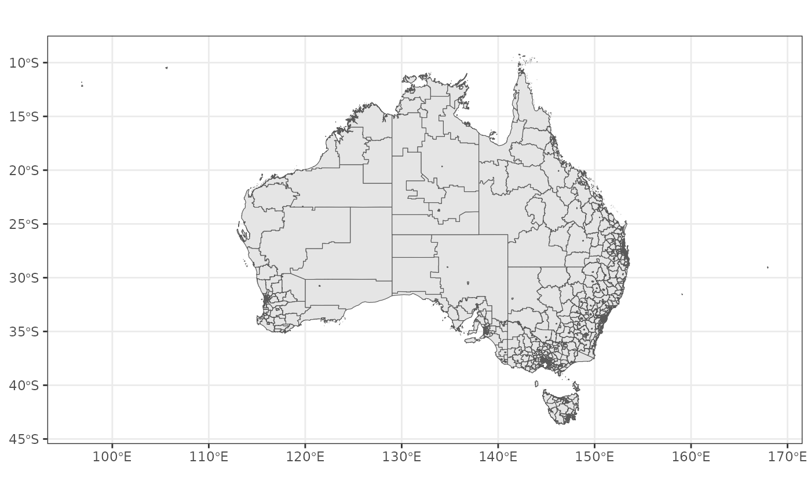
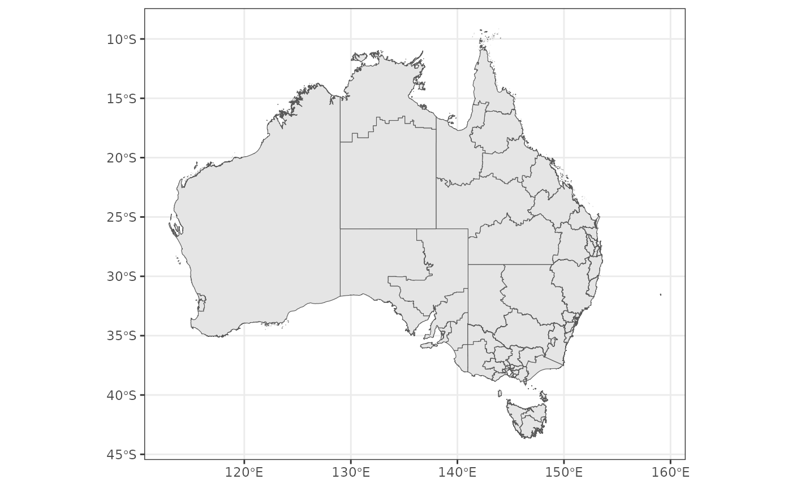
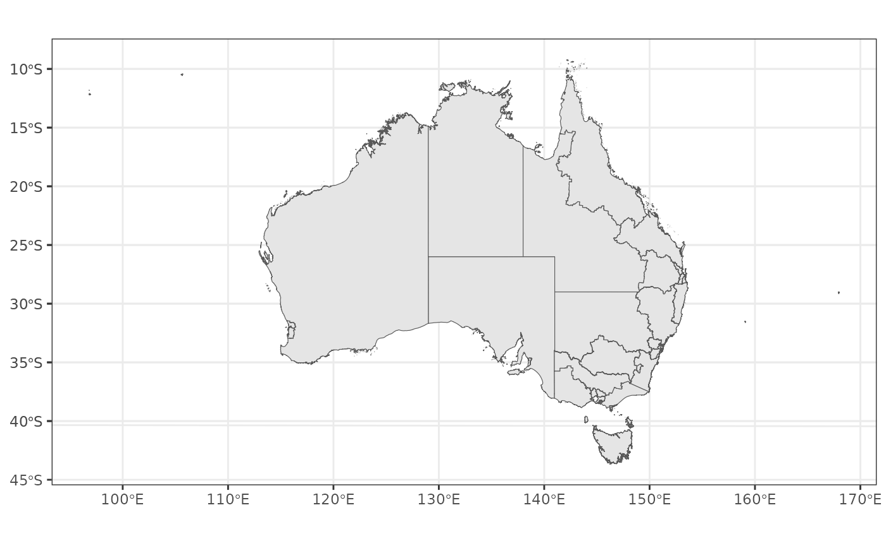
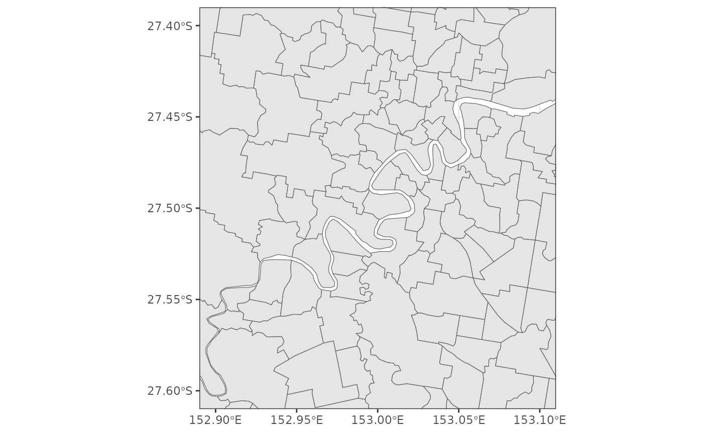
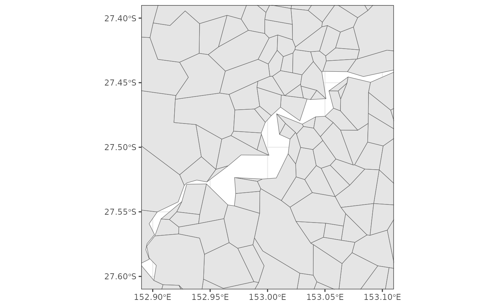

# Loading polygons

``` r

library(hpa.spatial)
library(sf)
library(dplyr)
library(ggplot2)
```

[`get_polygon()`](https://healthpolicyanalysis.github.io/hpa.spatial/reference/get_polygon.md)
works very similarly to `?strayr::read_absmap()` and it has access to
all the same shape files but also has access to additional data from
[`{hpa.spatial.data}`](https://github.com/healthpolicyanalysis/hpa.spatial.data).

``` r

quick_plot <- function(poly) {
  ggplot() +
    geom_sf(data = poly) +
    theme_bw()
}
```

``` r

get_polygon("sa22016") |> quick_plot()
```



``` r

get_polygon("LHN") |> quick_plot()
#> The data for the Local Hospital Networks (LHN) are from here: <https://hub.arcgis.com/datasets/ACSQHC::local-hospital-networks/explore>
```



``` r

get_polygon("PHN") |> quick_plot()
#> The data for The Primary Health Network (PHN) are from here: <https://data.gov.au/dataset/ds-dga-ef2d28a4-1ed5-47d0-8e3a-46e25bc4f66b/details?q=primary%20health%20network>
```



It includes an argument, `simplify_keep`, which allows the user to
simplify shape files (which is helpful when being used in interactive
maps to reduce load time).

``` r

sa2_2016 <- get_polygon(area = "sa2", year = 2016)
#> Reading sa22016 file found in /tmp/RtmpthHf8i
sa2_2016_simple <- get_polygon(area = "sa2", year = 2016, simplify_keep = 0.1)
#> Reading sa22016 file found in /tmp/RtmpthHf8i

sa2_2016 |>
  filter(gcc_name_2016 == "Greater Brisbane") |>
  quick_plot() +
  scale_x_continuous(limits = c(152.9, 153.1)) +
  scale_y_continuous(limits = c(-27.4, -27.6))

sa2_2016_simple |>
  filter(gcc_name_2016 == "Greater Brisbane") |>
  quick_plot() +
  scale_x_continuous(limits = c(152.9, 153.1)) +
  scale_y_continuous(limits = c(-27.4, -27.6))
```


